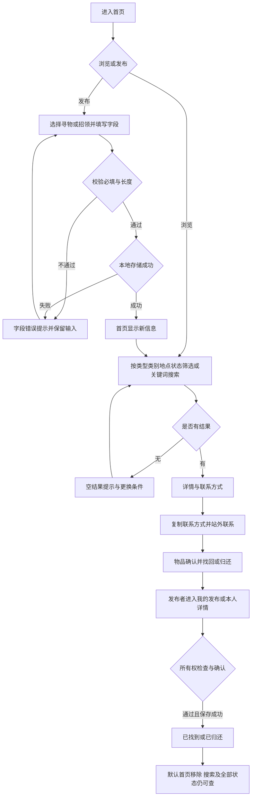
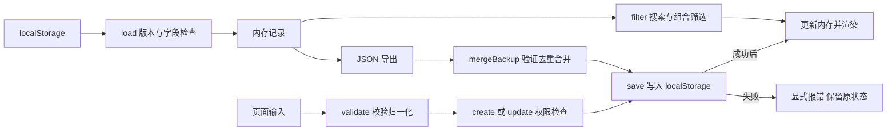

# 2026 秋软件工程第二次结对作业：校园失物招领程序实现

> 本文记录校园失物招领网页版的设计、实现与测试。作者：梁洪睿，学号：102402129。项目包含 AI 辅助实现与验证；个人工时和结对过程尚待据实补录。

## 1. 作业与结对信息

- 姓名：梁洪睿
- 学号：102402129
- 本人博客：[梁洪睿的博客](https://www.cnblogs.com/youone)
- 结对同学：学号 102402130，姓名与博客链接待补充
- 本人本次作业博客：发布后补充永久链接
- 队友本次作业博客：[待填]
- GitHub 项目：[102402130-102402129](https://github.com/vic155/102402130-102402129)（新实现尚未推送，提交后核对）
- 群内结对表、项目地址填写情况：[本人确认]

## 2. 具体分工

建议拆分为 UI 与业务逻辑、单元测试与交互走查、文档与代码复审三个阶段，双方交叉复审；以下记录必须改成实际执行的分工。

| 成员 | 实际负责模块 | 复审与测试 | 关联 commit / PR |
|---|---|---|---|
| 102402130 | 待填写 | 待填写 | 待填写 |
| 梁洪睿（102402129） | 待本人确认 | 待本人确认 | 待填写真实记录 |

## 3. PSP

记录人：梁洪睿（102402129）。

以下预估在实现代码前记录，是本次辅助开发的计划值；不冒充两位同学的个人 PSP。实际耗时请各自据实填写，不能把 AI 执行时长等同于结对编程时间。

| PSP2.1 | 阶段 | 预估分钟 | 实际分钟 |
|---|---|---:|---|
| Planning / Estimate | 计划与估计 | 15 | 待填写 |
| Analysis | 需求分析与原型检查 | 30 | 待填写 |
| Design Spec | 设计文档 | 20 | 待填写 |
| Design Review | 设计复审 | 10 | 待填写 |
| Coding Standard | 编码规范 | 10 | 待填写 |
| Design | 具体设计 | 25 | 待填写 |
| Coding | 具体编码 | 120 | 待填写 |
| Code Review | 代码复审 | 25 | 待填写 |
| Test | 测试与修复 | 60 | 待填写 |
| Test Report | 测试报告 | 20 | 待填写 |
| Size Measurement | 工作量统计 | 10 | 待填写 |
| Postmortem & Process Improvement Plan | 总结与改进 | 15 | 待填写 |
| 合计 | 分项合计（开发、报告父项不重复相加） | 360 | 待填写 |

填写后分析差异和返工原因，附真实起止时间及个人工作记录。

## 4. 解题思路与设计实现

### 需求与原型改进

核心闭环为发布、浏览 / 搜索、查看详情、站外联系、发布者更新状态。保留原型的绿色界面、橙色寻物标记及首页 / 搜索 / 发布 / 我的发布结构。将原型统一的“已解决”改为寻物“已找到”、招领“已归还”；搜索和全部状态中保留结束记录。新增复制联系方式、JSON 备份及存储失败提示。没有实现即时聊天、地图或实名认证。

原型的静态 `mine` 标记改为本机随机 `ownerId`，对编辑及状态更新统一做所有权检查。这个方案适用于本地作业演示，不支持跨设备真实用户认证。示例属于独立发布者。

需求依据为题目及已有原型，尚未获得真实访谈效果数据，不能据此宣称寻物时间从数天缩短至数小时。若实际开展访谈或试用，在此补充日期、对象、原话、发现及对应改动。

### 分层与数据

`index.html` 提供页面结构，`style.css` 负责视觉和响应式布局；`core.js` 封装可独立测试的业务函数，`app.js` 处理 DOM 和事件。记录包含 id、type、title、category、location、time、desc、contact、ownerId、owner、status、createdAt、updatedAt。本地数据使用版本号以便验证备份和读取格式。

### 主流程图



### 数据流图



### 关键代码与解释

```js
const item = items.find(x => x.id === id);
if (!owned(item, ownerId)) throw new Error('仅发布者可以修改这条信息');
```

权限判断位于业务层，按钮是否显示之外，还检查函数实际操作的记录。界面隐藏不能代替业务检查；本地环境下仍不构成服务端安全认证。

```js
const next = { ...data, items };
try {
  LF.save(localStorage, next);
  data = next;
  return true;
} catch (error) {
  reportStorage(error);
  return false;
}
```

先保存再提交内存状态，避免配额满或存储被禁用时用户看到“发布成功”，刷新后记录却丢失。表单仅在保存成功后清空。

## 5. 附加特点

1. **组合筛选**：信息类型、六种类别、遗失 / 拾获地点及状态可组合，减少无关信息。类别和地点来自真实记录，不依赖示意地图。
2. **一键复制联系方式**：优先 Clipboard API，直接打开文件时遇到权限限制则尝试兼容复制，再失败提示手动复制，不虚报成功。
3. **备份导出 / 导入**：离线使用时可保存数据；验证版本、结构、重复 ID、长度和文件大小，按 ID 合并且保持原记录所有权。

```js
const ids = new Set(data.items.map(x => x.id));
const incoming = backup.items.filter(x => !ids.has(x.id));
const items = [...data.items, ...incoming];
```

备份再次导入不会生成重复记录，已有记录不被覆盖。合并不改变本机身份，所以导入他人的备份不能获取其编辑权限。

### 实现成果展示

首页支持类型、类别、地点和状态组合筛选，桌面采用双列信息卡片。


发布页面对必填字段给出错误提示，错误提交不增加记录。


详情展示描述与联系方式，本机发布者可以编辑和更新状态。


已找到的信息仍保留在“我的发布”中，允许重新开启。


小屏幕采用单列卡片和底部导航。


以上图片已保存在本地，发布博客时需上传到博客园并替换图片链接。

## 6. 目录与使用说明

### 目录组织

```text
index.html                       程序入口（评分请打开此文件）
css/style.css                    原型样式及桌面 / 手机自适应
js/core.js                       校验、筛选、发布、权限、状态、存储、备份
js/app.js                        页面渲染、交互、复制、错误反馈
assets/data.js                   虚构示例数据
docs/PSP.md                      实现前预估及个人实际耗时待填表
docs/博客草稿.md                  按评分要求组织的博客草稿
docs/测试报告.md                  单元测试与 Chrome 走查结果
docs/screenshots/                实现效果截图
tests/core.test.cjs               本地单元测试（Git 忽略，不随仓库上传）
tests/browser.cjs                本地 Chrome 走查（Git 忽略）
校园失物招领小程序原型/           原仓库原型，保留供比较
校园失物招领小程序.html           原仓库旧入口，保留原始材料
```

### 测试人员操作指南

1. 下载完整仓库并解压，保留目录结构。
2. 在 Google Chrome 中打开根目录 **index.html**，无需安装 Node、Python，也无需启动服务器。
3. 初次运行会显示 10 条虚构示例（8 条进行中、2 条已完成）；示例联系方式不能用于真实联系。
4. 点击“发布”，选择寻物 / 招领，填写名称、地点、联系方式；时间、描述选填。
5. 首页可组合筛选类型、类别、地点和状态；搜索支持名称、地点、类别及描述，忽略首尾空白和英文大小写。
6. 点击信息卡片查看详情，可复制联系方式，再通过提供的方式在站外联系。
7. 发布者在“我的发布”或自己的详情页点击“标记已找到” / “标记已归还”，确认后结束信息；也可重新开启。已完成信息默认退出首页进行中列表，在状态筛选及搜索中仍可看到结果。
8. “我的发布”支持编辑信息和 JSON 备份导出 / 导入。

数据仅保存在当前浏览器，不提供跨设备同步。运行网页无需依赖安装。

## 7. 单元测试与简易教程

选用 Node 内置 `node:test` 和 `node:assert/strict`，无需安装测试框架。把业务函数从 DOM 脚本中分离，浏览器通过全局 LF 使用，Node 通过 CommonJS 导出使用同一份实现。

学习过程：[填写本人实际参考资料、学习时间与练习，不写未发生的过程]。

教程：安装 Node 22；创建 `tests/core.test.cjs`；导入 test、assert 和业务模块；为一个输入准备可预测输出；运行 `node --test tests/core.test.cjs`；检查失败断言并回归受影响逻辑。

```js
const { test } = require('node:test');
const assert = require('node:assert/strict');
const LF = require('../js/core.js');
test('非发布者不能更新状态', () => {
  const item = LF.create({ type: 'lost', title: '校园卡',
    category: '卡证证件', location: '图书馆', contact: 'QQ：demo' },
    'owner-a', 'one', 100);
  assert.throws(() => LF.update([item], 'one', 'owner-b', { status: 'done' }));
  assert.equal(item.status, 'open');
});
```

测试覆盖正常输入、空白值、长度边界、特殊字符、越权操作、非法状态、持久化空列表、存储异常和备份损坏。测试结果与 Chrome 走查记录见 `docs/测试报告.md`。至少 5 个用例，当前实现为 13 组单元测试。考虑测试者可能输入 `.*`、HTML 标签、31 个字符名称或伪造备份，检验失败时状态不被破坏，而不仅测试成功路径。

### 用例与执行结果

| 编号 | 测试对象 | 构造数据与预期 | 结果 |
|---|---|---|---|
| 1 | validate | 名称、地点、联系方式纯空白均拒绝 | 通过 |
| 2 | validate | 名称 30 字接受、31 字拒绝，类型 / 类别非法拒绝 | 通过 |
| 3 | create | 去除首尾空白，选填时间不编造为发布时间 | 通过 |
| 4 | filter | 英文大小写与首尾空白，`[Pro]`、`.*` 按字面搜索 | 通过 |
| 5 | filter | 类别 / 类型 / 地点 / 状态组合，倒序但不改变源数组 | 通过 |
| 6 | update / statusText | 非发布者及非法状态拒绝；已找到、已归还按类型显示 | 通过 |
| 7 | update | 编辑不改变 ID、发布者及创建时间；越权编辑拒绝 | 通过 |
| 8 | filter / update | 关闭后进行中隐藏，搜索仍见，可重新开启 | 通过 |
| 9 | load / save | 持久化保留身份，空列表不会自动填入种子 | 通过 |
| 10 | load / save | JSON 损坏、配额错误显式抛出 | 通过 |
| 11 | mergeBackup | 已存在 ID 不重复导入，导入不接管发布者权限 | 通过 |
| 12 | mergeBackup | 损坏数据、未知版本、重复 ID、非法状态、超过 2 MB 均拒绝 | 通过 |
| 13 | escape | 标签、双引号、单引号和 & 转义 | 通过 |


2026-10-07 在 Node.js v22.12.0 执行，13 组单元测试全部通过；通过 Playwright 驱动 Google Chrome 154.0.8037.98，直接打开 file:// 网页，11 组交互流程检查通过，无未捕获页面异常。验证覆盖桌面 1280 × 1100 和手机 375 × 812 视口。

## 8. GitHub 签入记录

[待加入真实 GitHub commits 和 PR 页面截图。] 根据真实贡献小步提交、写清目的；一方 fork 后提交 PR，由另一方复审合并。没有发生的提交、评审、结对协作不能补造。

## 9. 代码异常 / 结对困难

本次检查发现原型存储异常被吞掉、已解决信息在搜索不可见、统一状态文案不够准确。实现改为保存失败显式提示、搜索覆盖已完成信息、按类型显示结束状态，并通过函数测试和浏览器交互验证。可讨论分层的收益及本地演示的限制。

个人真实异常和结对困难：[补充问题描述、做过的尝试、结果和收获，并注明实际负责者。]

## 10. 队友评价

- 值得学习之处：[依据具体真实合作片段填写]
- 需要改进之处：[依据真实情况给出可执行建议]

## 提交检查

- 补完全部占位与个人 PSP；上传真实截图。
- 双方完成博客；检查互相链接及 GitHub 新实现。
- 在截止前填写群内结对表和项目地址，检查 QQ 群补充通知。
