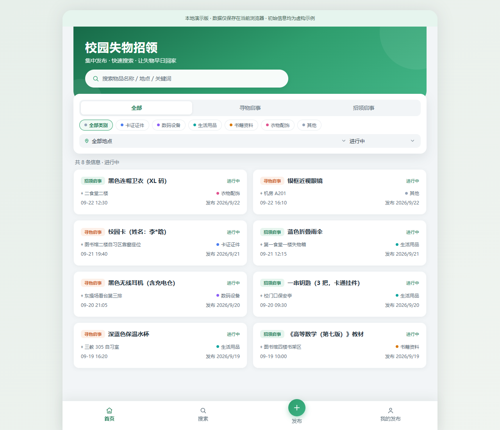
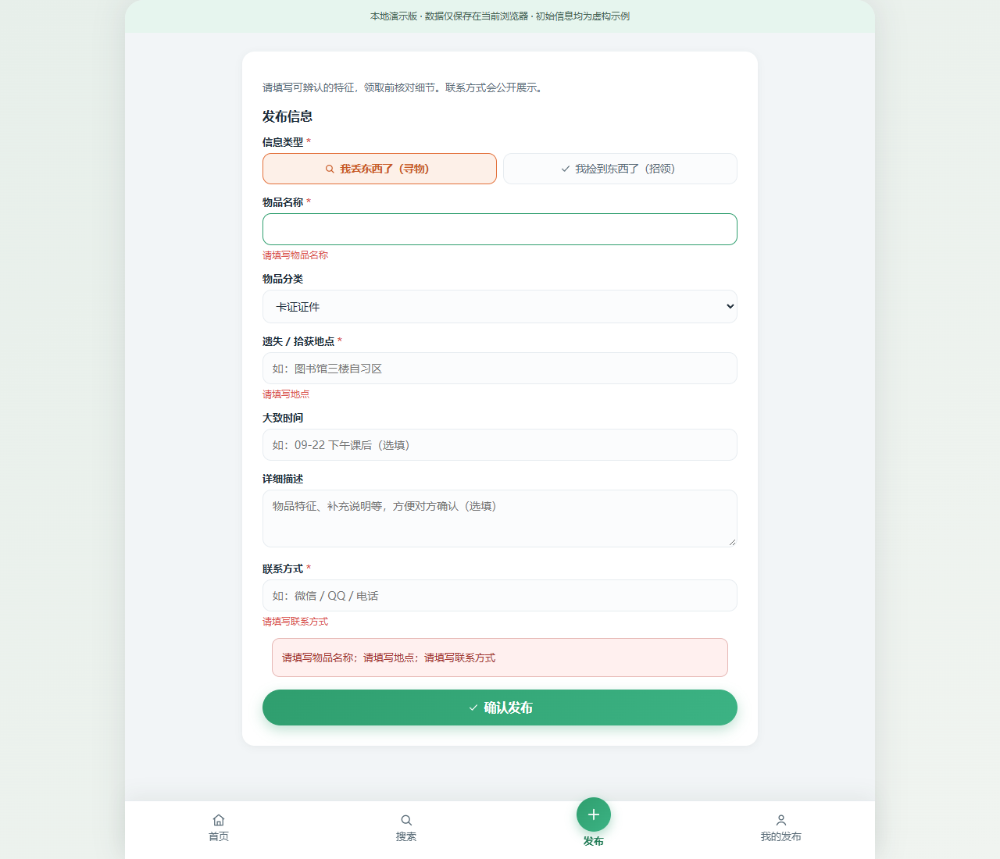
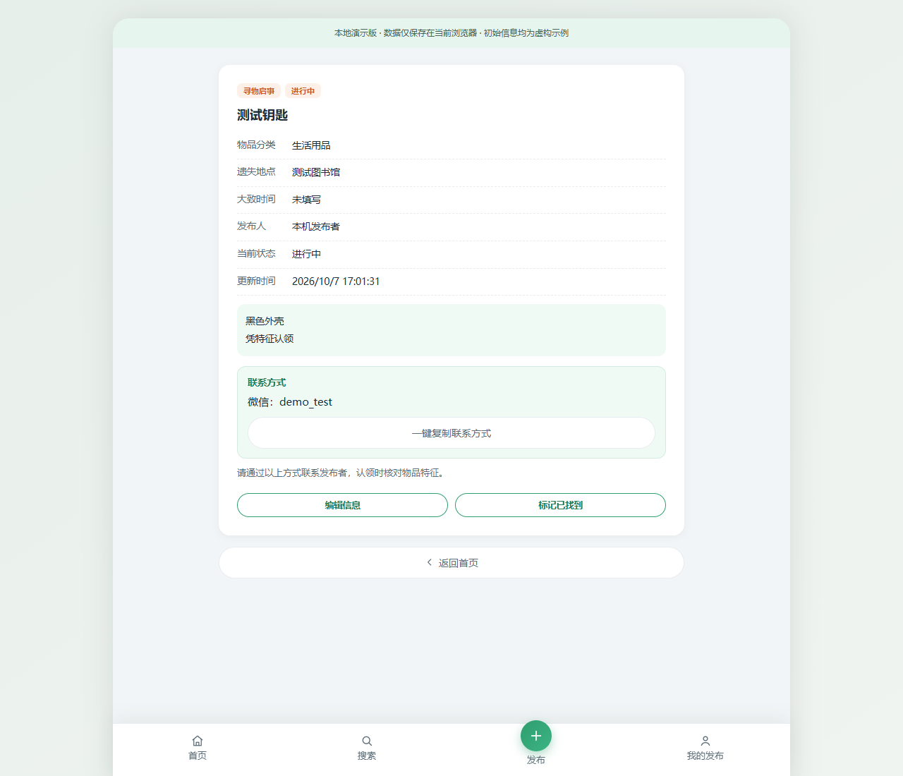
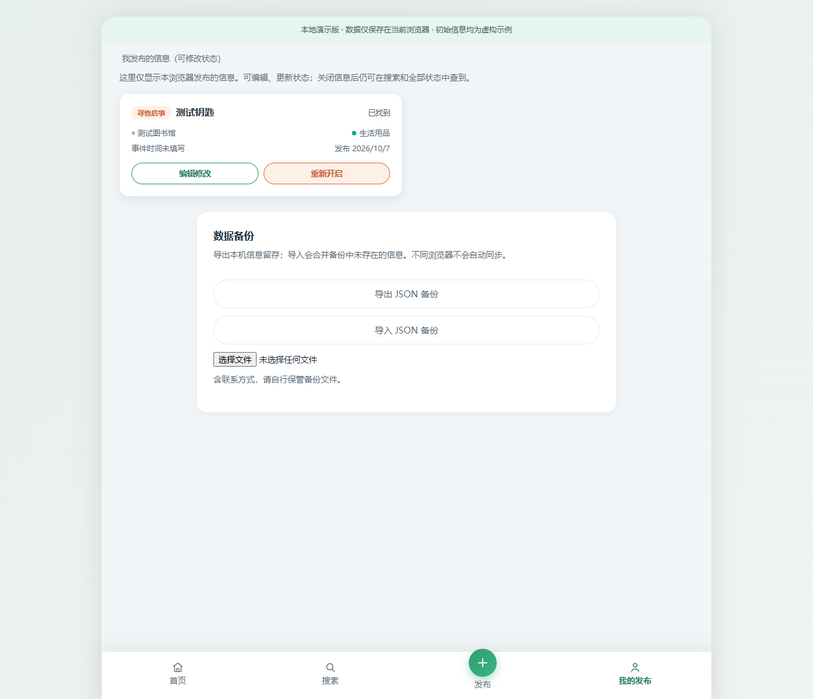
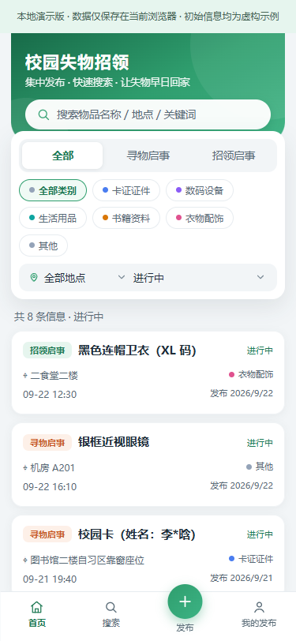

# 测试报告

测试日期：2026-10-07（北京时间）。本报告记录辅助开发期间实际执行的检查，不代替两位同学自己的测试、学习记录及工时。

## 环境与结论

- Windows；Node.js v22.12.0。
- Google Chrome 154.0.8037.98；通过 Playwright 驱动已安装的 Chrome，直接访问 `file:///.../index.html`，未用开发服务器代替直接打开文件。
- 桌面视口 1280 × 1100；手机视口 375 × 812。
- 单元测试 **13 / 13 通过**；Chrome **11 组流程检查通过**，无未捕获页面异常。
- 浏览器测试使用隔离的临时上下文，不向用户日常 Chrome 配置写入测试数据。
- 已查看首页、详情和手机截图，核对布局及中文显示；手机首页、搜索和发布页没有横向溢出。

## 单元测试

命令：`node --test tests/core.test.cjs`。代码保留在本地，按作业说明通过 `.gitignore` 排除上传。

| 编号 | 测试对象 | 构造数据与预期 | 结果 |
|---|---|---|---|
| 1 | validate | 名称、地点、联系方式纯空白均拒绝 | 通过 |
| 2 | validate | 名称 30 字接受、31 字拒绝，类型 / 类别非法拒绝 | 通过 |
| 3 | create | 去除首尾空白，选填时间不编造为发布时间 | 通过 |
| 4 | filter | 英文大小写与首尾空白，`[Pro]`、`.*` 按字面搜索 | 通过 |
| 5 | filter | 类别 / 类型 / 地点 / 状态组合，倒序但不改变源数组 | 通过 |
| 6 | update / statusText | 非发布者及非法状态拒绝；已找到、已归还按类型显示 | 通过 |
| 7 | update | 编辑不改变 ID、发布者及创建时间；越权编辑拒绝 | 通过 |
| 8 | filter / update | 关闭后进行中隐藏，搜索仍见，可重新开启 | 通过 |
| 9 | load / save | 持久化保留身份，空列表不会自动填入种子 | 通过 |
| 10 | load / save | JSON 损坏、配额错误显式抛出 | 通过 |
| 11 | mergeBackup | 已存在 ID 不重复导入，导入不接管发布者权限 | 通过 |
| 12 | mergeBackup | 损坏数据、未知版本、重复 ID、非法状态、超过 2 MB 均拒绝 | 通过 |
| 13 | escape | 标签、双引号、单引号和 & 转义 | 通过 |

原始测试汇总：tests 13，pass 13，fail 0，skipped 0。

## Chrome 流程走查

| 编号 | 操作 | 观测结果 |
|---|---|---|
| 1 | file:// 启动、查看示例、复制联系方式 | 显示 8 条进行中；示例无编辑 / 状态入口；复制反馈正确 |
| 2 | 发布空白名称及缺失字段 | 显示字段错误，记录数不增加 |
| 3 | 发布寻物→详情→站外联系入口→我的发布关闭 | 首页新增，详情展示联系方式，完成后显示已找到，退出进行中 |
| 4 | 搜索完成记录，进入详情再返回，清空搜索 | 已找到仍可搜索；返回保留关键词；清空后移除旧结果；完成筛选可见 |
| 5 | 发布招领→取消确认→确认关闭 | 取消时状态不变；确认后已归还 |
| 6 | 编辑 HTML 特殊字符，刷新后查看我的发布 | 标签作为文本显示、不生成 img；记录与所有权保留 |
| 7 | 组合类别、地点、类型和全部状态 | 仅留下对应的测试招领信息 |
| 8 | 导出 JSON，重新导入，导入损坏文件 | 下载包含 12 条记录；重复导入无新增；损坏文件拒绝且原数据不变 |
| 9 | 注入 setItem 配额失败再发布 | 保留表单、内存记录数不变、显示存储错误、没有发布成功提示 |
| 10 | 手机视口查看首页、搜索、发布 | 无横向溢出；底部导航可用 |
| 11 | 启动前注入损坏本地 JSON | 错误显式展示，原始坏数据未被覆盖 |

站外微信 / QQ 联系和真实物品交接不属于网页自动化，测试验证的是联系方式展示及状态入口；真实用户试用需要同学自行开展并记录。

## 截图

## 范围与限制

测试验证单浏览器离线演示闭环。没有验证跨设备同步、服务端身份认证或真实全校共享，因为本项目未实现这些能力。其他 Chrome 版本、手机浏览器及长时间高容量使用未经验证。测试代码不模拟或证明真实结对提交、用户访谈或使用效果。
