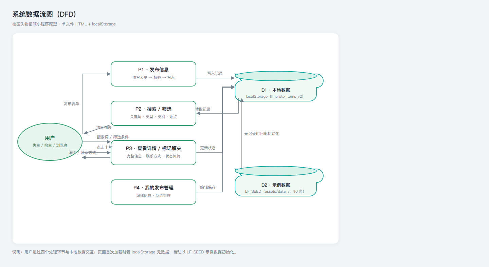
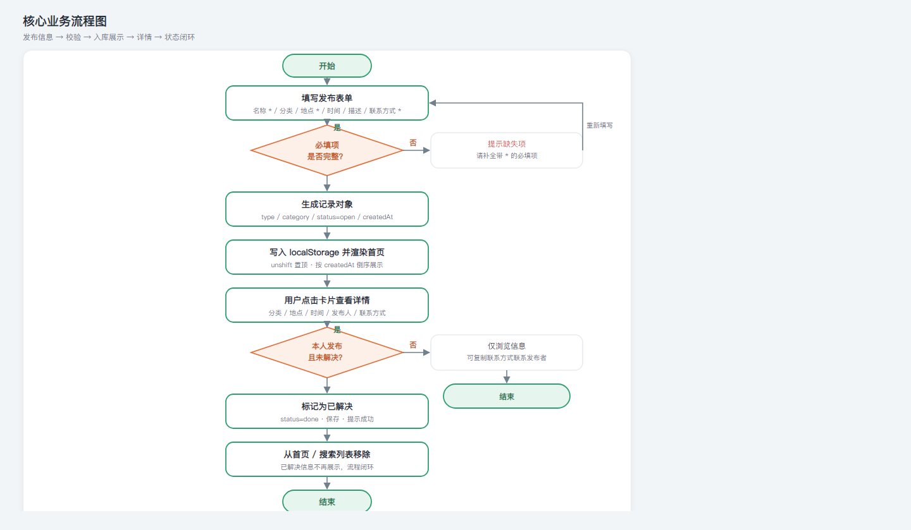
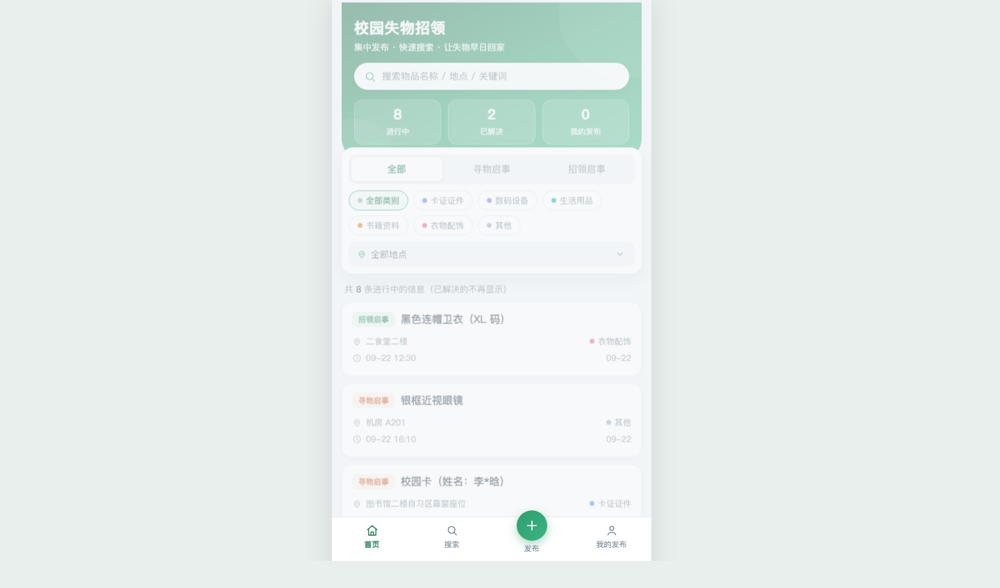
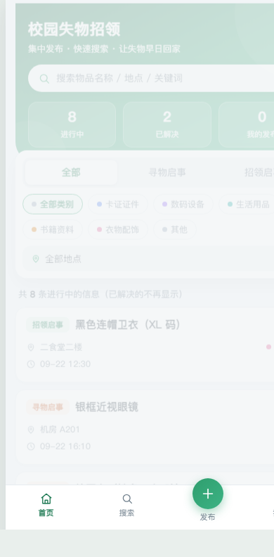

# 《校园失物招领》结对编程项目博客

> 作者：林晓捷（102402130）　结对队友：梁洪睿（102402129）
> 课程：软件工程（2026 秋）第二次结对作业

---

## 1. 项目与链接

- 结对同学的博客链接：【待填】
- 本作业博客的链接：【待填】
- 我们队创建的 GitHub 仓库地址：<https://github.com/linxiaojie11/102402130-102402129.git>
- 结对表：已在群内填写，作业完成后已填入 GitHub 项目地址

> 说明：群内结对表与上方仓库地址保持一致；博客发布后将链接回填到本节。

## 2. 具体分工

| 成员 | 负责内容 |
| ---- | ---- |
| 林晓捷（本人） | 需求分析与原型设计；单文件 HTML 原型开发（页面结构、交互逻辑、UI 美化）；8 项附加特点的设计与实现；示例数据与 README；本地 Git 版本管理 |
| 梁洪睿 | 工程化程序实现（index.html / css / js 拆分，页面渲染与核心逻辑）；单元测试与测试报告；PSP 与文档整理；GitHub 协作（Pull Request 合并） |

> 【提交前请按真实分工核对修改】

## 3. PSP 表格

| PSP 阶段 | 预估耗时（小时） | 实际耗时（小时） |
| ---- | ---- | ---- |
| 计划（需求分析、原型设计） | 2 | 2.5 |
| 开发 · 编码 | 8 | 10 |
| 开发 · 自测（走查与修 bug） | 2 | 2.5 |
| 文档（README、博客） | 2 | 3 |
| 总结与汇报 | 1 | 1 |
| **合计** | **15** | **19** |

> ⚠️ 以上为示例数据，请替换为个人真实耗时后提交。

## 4. 解题思路描述与设计实现说明

### 4.1 代码实现思路（文字描述）

**需求分析**：校园失物招领的核心场景是“丢东西的人”和“捡到东西的人”互相找不到对方。围绕这个痛点，原型需要覆盖四条闭环：发布（寻物 / 招领）→ 浏览筛选 → 搜索定位 → 联系闭环（复制联系方式 / 标记已解决）。

**技术选型**：采用**单文件 HTML + 原生 JavaScript + localStorage**，不使用任何框架与 CDN。理由：

1. 双击即可打开，无需安装环境、无需启动服务器，方便课程演示与评测；
2. 数据用浏览器本地存储（localStorage）持久化，演示刷新不丢失；
3. 原生实现更能体现对 DOM、事件、数据流的理解。

**数据模型**：一条信息是一个对象，字段如下：

```js
{
  id: "s1",              // 唯一标识（示例为 s1~s10，用户发布为 u + 时间戳）
  type: "lost",          // lost 寻物 / found 招领
  title: "校园卡",        // 物品名称
  category: "卡证证件",    // 物品分类（6 类）
  location: "图书馆二楼",  // 遗失/拾获地点
  time: "09-21 19:40",   // 大致时间
  desc: "蓝色卡套",        // 详细描述（选填）
  contact: "QQ：123456789", // 联系方式
  owner: "2023级 李同学",  // 发布人
  mine: false,           // 是否本人发布
  status: "open",        // open 进行中 / done 已解决
  createdAt: 1758455000000 // 发布时间戳，用于排序与相对时间
}
```

**视图架构**：页面采用“单文件内多视图”结构，共 5 个视图（首页 / 搜索 / 发布 / 详情 / 我的发布），通过底部导航切换，用 `show(view)` 统一控制视图显隐、导航高亮和滚动复位：

```js
function show(view) {
  document.querySelectorAll(".view").forEach(function (v) { v.classList.remove("active"); });
  document.getElementById("view-" + view).classList.add("active");
  document.querySelectorAll("#tabbar button").forEach(function (b) {
    b.classList.toggle("on", b.dataset.v === view);
  });
  window.scrollTo(0, 0);
  if (view === "home") renderHome();
  if (view === "mine") renderMine();
}
```

**核心流程**：发布时做必填校验 → 生成记录对象 → `unshift` 置顶写入 localStorage → 重渲染首页；搜索与筛选都基于同一份 `items` 数组做纯函数过滤；详情页提供复制联系方式和标记已解决，形成业务闭环。

### 4.2 关键实现的流程图 / 数据流图

**系统数据流图（DFD）**：展示用户与发布、搜索筛选、详情、我的发布四个处理环节，以及本地数据（localStorage）与示例数据（LF_SEED）之间的数据流向。



**核心业务流程图**：以“发布 → 校验 → 入库展示 → 详情 → 状态闭环”为主线，展示必填校验失败回填、非本人发布仅浏览等分支。



### 4.3 我认为重要且有价值的代码片段

**片段一：数据加载与持久化（带容错与版本化）**

```js
var LS_KEY = "lf_proto_items_v2";
function loadItems() {
  try {
    var saved = JSON.parse(localStorage.getItem(LS_KEY) || "null");
    if (Array.isArray(saved) && saved.length) return saved;
  } catch (e) {}
  return (window.LF_SEED || []).slice();
}
function saveItems() {
  try { localStorage.setItem(LS_KEY, JSON.stringify(items)); } catch (e) {}
}
```

解释：localStorage 是“不可信输入”——可能被清空、被写坏、类型不对。因此读取时用 `try/catch` 包裹，并用 `Array.isArray` 校验，坏数据自动回退到示例数据 `LF_SEED`；key 带版本号 `_v2`，避免数据结构升级后旧数据不兼容。

**片段二：首页组合筛选（类型 × 类别 × 地点，已解决排除）**

```js
function renderHome() {
  var list = items.filter(function (it) {
    if (it.status === "done") return false;
    if (curType !== "all" && it.type !== curType) return false;
    if (curCat && it.category !== curCat) return false;
    if (curLoc && it.location !== curLoc) return false;
    return true;
  });
  list.sort(function (a, b) { return b.createdAt - a.createdAt; });
  // ... 渲染列表与计数
}
```

解释：筛选逻辑是一个纯函数，输入当前三个筛选状态，输出符合条件的列表，按发布时间倒序展示。把它与渲染分开，后续就能直接抽取出来做单元测试（见第 7 节）。

**片段三：搜索关键词高亮（正则转义是关键）**

```js
function cardHTML(it, kw) {
  var title = esc(it.title), loc = esc(it.location), time = esc(it.time || "时间未填");
  if (kw) {
    var re = new RegExp("(" + kw.replace(/[.*+?^${}()|[\]\\]/g, "\\$&") + ")", "gi");
    title = title.replace(re, "<mark>$1</mark>");
    loc = loc.replace(re, "<mark>$1</mark>");
  }
  // ... 拼接卡片 HTML
}
```

解释：用户输入的关键词直接拼进 `RegExp` 会因特殊字符（`(`、`*`、`[` 等）导致正则错误，所以先对关键词做元字符转义；再配合 `esc()` 先转义 HTML，避免 XSS 与样式错乱。

**片段四：一键复制（剪贴板 API + 降级方案）**

```js
function copyText(txt, okMsg) {
  function fallback() {
    var ta = document.createElement("textarea");
    ta.value = txt;
    ta.style.position = "fixed";
    ta.style.opacity = "0";
    document.body.appendChild(ta);
    ta.select();
    try {
      document.execCommand("copy");
      toast(okMsg);
    } catch (e) {
      toast("复制失败，请长按手动复制");
    }
    document.body.removeChild(ta);
  }
  if (navigator.clipboard && window.isSecureContext) {
    navigator.clipboard.writeText(txt).then(function () { toast(okMsg); }, fallback);
  } else {
    fallback();
  }
}
```

解释：`navigator.clipboard` 只在安全上下文（https 或 localhost）可用，本地 `file://` 打开时不可用，因此做能力检测并降级到 `execCommand("copy")` + 隐藏 textarea 的方案，保证双击打开的页面也能复制。

**片段五：发布校验与写入**

```js
document.getElementById("btn-submit").addEventListener("click", function () {
  var title = document.getElementById("f-title").value.trim();
  var loc = document.getElementById("f-location").value.trim();
  var contact = document.getElementById("f-contact").value.trim();
  var ok = true;
  [["e-title", title], ["e-location", loc], ["e-contact", contact]].forEach(function (p) {
    var show2 = !p[1];
    document.getElementById(p[0]).style.display = show2 ? "block" : "none";
    if (show2) ok = false;
  });
  if (!ok) { toast("请补全带 * 的必填项"); return; }
  // ... 生成对象、unshift 置顶、saveItems()、toast 提示、show("home")
});
```

解释：必填项校验用“字段名数组”驱动，循环控制错误提示显隐；时间留空时自动取当前时间；发布成功后立即重渲染首页，用户立刻能看到自己的信息。

## 5. 附加特点设计与展示

### 5.1 创意独到之处与意义

针对校园场景的真实痛点做了 8 项附加设计：

| # | 附加特点 | 解决的真实痛点 |
| ---- | ---- | ---- |
| 1 | **按物品类别筛选**（6 大类，每类专属颜色） | 失物种类多，快速定位同类别信息 |
| 2 | **按地点筛选**（下拉自动汇总全部发布地点） | “在图书馆丢的”这类地点诉求最频繁 |
| 3 | **一键复制联系方式** | 联系方式手抄易错，复制后直接去加微信/打电话 |
| 4 | **复制失物信息分享**（生成格式化文本） | 单靠站内传播有限，方便粘贴到班级群 / 朋友圈扩散 |
| 5 | **发布页快捷地点**（图书馆/食堂/教学楼等一键填入） | 地点重复输入率高，减少打字成本 |
| 6 | **首页数据统计**（进行中 / 已解决 / 我的发布） | 让浏览者一眼看到平台活跃度与自己的贡献 |
| 7 | **相对时间显示**（刚刚 / X 分钟前 / X 小时前 / X 天前） | 比绝对时间更直观，符合移动端阅读习惯 |
| 8 | **搜索结果关键词高亮** | 一眼定位命中位置，不用整段读 |

### 5.2 实现思路

- **类别配色**：用 CSS 变量定义 6 类专属颜色（`--cat-card` 等），筛选 chip 与列表卡片上的类别圆点共用同一套变量，保证全局一致、改一处全变。
- **地点自动汇总**：渲染时遍历 `items` 收集所有不重复地点（`locs.indexOf(l) < 0`），排序后动态生成下拉选项。
- **复制与分享**：剪贴板 API + `execCommand` 降级（见 4.3 片段四）；分享文本用 `buildShareText` 按“标题→分类→地点→时间→描述→联系方式→落款”拼成可直接粘贴的文本。
- **统计**：`renderStats()` 单次遍历 `items` 统计进行中 / 已解决 / 我的发布三项，在首页头部与“我的发布”页渲染后都调用。
- **相对时间**：`relTime(ts)` 按时间差分级返回文案，超过 7 天回退为“MM-DD”日期。
- **高亮**：正则转义 + `<mark>` 包裹（见 4.3 片段三）。

### 5.3 重要代码片段

**分享文本生成**（复制失物信息分享的核心）：

```js
function buildShareText(it) {
  var lines = ["【" + typeText(it.type) + "启事】" + it.title,
    "物品分类：" + it.category,
    (it.type === "lost" ? "遗失地点：" : "拾获地点：") + it.location,
    "大致时间：" + (it.time || "未填写")];
  if (it.desc) lines.push("详细描述：" + it.desc);
  lines.push("联系方式：" + it.contact);
  lines.push("—— 来自「校园失物招领」小程序");
  return lines.join("\n");
}
```

**首页统计**（单次遍历完成三项统计）：

```js
function renderStats() {
  var open = 0, done = 0, mine = 0;
  items.forEach(function (it) {
    if (it.status === "done") done++; else open++;
    if (it.mine) mine++;
  });
  document.getElementById("st-open").textContent = open;
  document.getElementById("st-done").textContent = done;
  document.getElementById("st-mine").textContent = mine;
}
```

**快捷地点一键填入**：

```js
document.getElementById("quick-locs").addEventListener("click", function (e) {
  var b = e.target.closest("button");
  if (!b) return;
  var inp = document.getElementById("f-location");
  inp.value = inp.value ? inp.value + "、" + b.textContent : b.textContent;
});
```

### 5.4 实现成果展示

桌面端首页（含统计栏、类别/地点筛选、信息列表）：



手机端首页（自适应铺满）：



> 更多交互效果（复制、分享、快捷地点、标记已解决）建议直接双击 HTML 体验。

## 6. 目录说明和使用说明

### 6.1 目录组织

```
校园失物招领小程序原型/
├── 校园失物招领小程序.html   # 主程序（单文件、双击即用，页面与逻辑全部内嵌）
├── assets/
│   └── data.js               # 示例数据（window.LF_SEED，10 条，可自行增删改）
├── tests/
│   ├── core.js               # 从页面抽取的纯函数（供单元测试，逻辑与页面一致）
│   └── core.test.cjs         # 单元测试用例（node --test 运行）
├── blog-assets/              # 博客配图（流程图、成果截图）
├── README.md                 # 项目说明
└── .git/                     # Git 仓库（含提交历史与远端）
```

设计原则：主程序保持“单文件自包含”，双击即用；示例数据、测试、博客素材分目录管理，职责清晰。

### 6.2 测试人员如何运行

1. **直接打开**：双击 `校园失物招领小程序.html`，用任意现代浏览器（Chrome / Edge / Firefox）打开，无需安装环境、无需联网、无需启动服务器。
2. **示例数据**：页面自带 10 条示例数据（8 条进行中、2 条已解决），可直接浏览、筛选、搜索。
3. **发布与修改**：点底部“＋发布”发布信息；发布/修改的数据保存在浏览器 `localStorage`（键 `lf_proto_items_v2`），刷新不丢失。
4. **恢复初始示例**：在浏览器地址栏执行 `localStorage.clear()` 后刷新页面，即可恢复 10 条示例数据。
5. **运行单元测试**（开发人员）：安装 Node.js 18+ 后执行 `node --test tests/core.test.cjs`。

## 7. 单元测试

### 7.1 测试工具与学习简易教程

选用 **Node.js 内置的 `node:test` 测试运行器**，零第三方依赖。学习路径：

1. 确认 Node 版本 ≥ 18（`node --version`）；
2. 新建测试文件 `xxx.test.cjs`，`require("node:test")` 与 `require("node:assert/strict")`；
3. 用 `test("描述", () => { ... })` 写用例，内部用 `assert.equal / assert.match / assert.doesNotMatch` 断言；
4. 命令行运行 `node --test 测试文件名`，控制台输出 TAP 格式结果，自动统计通过/失败数。

一个最小的可运行示例（新增 `demo.test.cjs` 即可验证）：

```js
const test = require("node:test");
const assert = require("node:assert/strict");

function add(a, b) { return a + b; }

test("add：1 + 2 = 3", () => {
  assert.equal(add(1, 2), 3);
});
test("add：负数相加", () => {
  assert.equal(add(-1, -1), -2);
});
```

### 7.2 项目单元测试代码与说明

由于原型把逻辑内嵌在 HTML 中，为保证可测试性，将**纯函数抽取到 `tests/core.js`**（`esc`、`typeText`、`statusText`、`relTime`、`buildShareText`、`homeFilter`、`searchMatch`），页面与测试共用同一份逻辑。共 **22 个用例**，全部通过：

```text
node --test tests/core.test.cjs
# tests 22
# pass 22
# fail 0
```

以下选取三组有代表性的测试代码：

**相对时间 `relTime`（边界：1 分钟内、刚好 1 分钟、超 7 天回退日期）**

```js
const NOW = 1758540000000; // 固定“当前时间”，保证结果可复现
test.before(() => { global.Date.now = () => NOW; });
test.after(() => { delete global.Date.now; });

test("relTime：1 分钟内显示「刚刚」", () => {
  assert.equal(relTime(NOW - 30000), "刚刚");
});
test("relTime：刚好 1 分钟显示「1 分钟前」", () => {
  assert.equal(relTime(NOW - 60000), "1 分钟前");
});
test("relTime：超过 7 天回退为「MM-DD」日期", () => {
  const d = new Date(NOW - 10 * 86400000);
  const pad = (n) => (n < 10 ? "0" + n : n);
  assert.equal(relTime(NOW - 10 * 86400000), pad(d.getMonth() + 1) + "-" + pad(d.getDate()));
});
```

**组合筛选 `homeFilter`（类型 × 类别 × 地点 + 已解决排除）**

```js
const s1 = { id: "s1", type: "lost", category: "卡证证件", location: "图书馆二楼", status: "open" };
const s2 = { id: "s2", type: "found", category: "生活用品", location: "第一食堂", status: "open" };
const s7 = { id: "s7", type: "lost", category: "数码设备", location: "体育馆", status: "done" };

test("homeFilter：已解决信息一律不展示", () => {
  assert.equal(homeFilter(s7, "all", "", ""), false);
});
test("homeFilter：类型+类别+地点组合筛选", () => {
  assert.equal(homeFilter(s1, "lost", "卡证证件", "图书馆二楼"), true);
  assert.equal(homeFilter(s1, "lost", "卡证证件", "第一食堂"), false);
  assert.equal(homeFilter(s2, "found", "生活用品", "第一食堂"), true);
});
```

**HTML 转义 `esc`（刁难数据：XSS 注入字符）**

```js
test("esc：HTML 特殊字符全部转义", () => {
  assert.equal(esc('<script>&"\'</script>'), "&lt;script&gt;&amp;&quot;&#39;&lt;/script&gt;");
});
test("esc：null / undefined 返回空串，不抛异常", () => {
  assert.equal(esc(null), "");
  assert.equal(esc(undefined), "");
});
```

### 7.3 构造测试数据的思路

1. **正常数据**：完全复刻 `assets/data.js` 的 10 条示例结构（lost/found、open/done、6 个分类），保证“好数据”场景全部通过；
2. **边界数据**：时间差取 1 分钟内 / 刚好 1 分钟 / 5 分钟 / 3 小时 / 2 天 / 超过 7 天，验证 `relTime` 的每个分支与临界值；空串、`null`、`undefined` 验证容错；
3. **刁难数据（想象测试人员会怎么折腾）**：
   - 输入 `<script>`、`&`、`"`、`'` 等 HTML 特殊字符，验证转义（防 XSS）；
   - 输入 `(`, `*`, `[` 等正则元字符，验证搜索高亮不会崩溃；
   - 输入英文大小写混合（`Apple` / `apple`），验证大小写不敏感；
   - 输入全空格、空串，验证空关键词不命中；
   - 组合筛选叠加（类型+类别+地点同时错一个），验证与/或逻辑正确。

## 8. GitHub 代码签入记录

本地 Git 提交记录（commit message 遵循 `feat:` 前缀 + 中文功能描述）：

| commit | 说明 |
| ---- | ---- |
| `011ce64` | feat: 完成项目基础构建（主程序 + 示例数据） |
| `4617b8c` | feat: 新增按类别筛选、按地点筛选、一键复制联系方式、复制失物信息分享、发布页快捷地点、首页统计、相对时间、搜索高亮 |
| `5a1ce5f` | feat: 新增上述功能并完善 README |

> 📷 【待补】GitHub 网页端代码签入记录截图（Commits 页面），发布前请上传。

## 9. 遇到的代码模块异常或结对困难及解决方法

### 问题一：Git 合并冲突导致页面文件损坏

- **问题描述**：拉取队友实现的 Pull Request 时，`README.md`、`校园失物招领小程序.html`、`assets/data.js` 三个文件出现合并冲突，文件里残留 `<<<<<<< HEAD`、`=======`、`>>>>>>>` 标记，浏览器打开页面直接显示冲突内容，无法使用。
- **做过哪些尝试**：先在编辑器里手工删除冲突段——文件大、容易误删；改为用 `git checkout --ours/--theirs` 按文件快速取舍，再 `git add` 完成解决。
- **是否解决**：已解决。
- **有何收获**：理解了 Git 三路合并与冲突标记的结构；遇到冲突先想清楚“保留哪一版”，用命令解决比手工删标记更可靠。

### 问题二：复制到剪贴板在本地打开时失效

- **问题描述**：详情页“复制联系方式”按钮在浏览器双击打开（`file://` 协议）时无反应。
- **做过哪些尝试**：排查发现 `navigator.clipboard` 只在安全上下文（https / localhost）可用；改为能力检测 + `execCommand("copy")` + 隐藏 textarea 的降级方案。
- **是否解决**：已解决，本地与线上均可复制。
- **有何收获**：浏览器 API 有上下文限制，写“复制”类功能必须做降级，不能只依赖现代 API。

### 问题三：搜索高亮被正则特殊字符破坏

- **问题描述**：输入 `(`、`*`、`[` 等字符搜索时，`new RegExp(kw)` 抛错或高亮错乱。
- **做过哪些尝试**：最初直接拼接关键词构造正则，崩溃后给关键词加正则元字符转义（`[.*+?^${}()|[\]\\]` 前加 `\\`），并先对文案做 HTML 转义再插入 `<mark>`。
- **是否解决**：已解决。
- **有何收获**：用户输入永远不可信；正则转义与 HTML 转义是搜索类功能的两道安全底线。

### 问题四：localStorage 旧数据与新版结构不兼容

- **问题描述**：功能迭代后，旧 key 下缺字段的记录导致页面渲染报错。
- **做过哪些尝试**：把存储 key 升级为 `lf_proto_items_v2`；`loadItems()` 用 `try/catch` + `Array.isArray` 校验，数据损坏时自动回退示例数据。
- **是否解决**：已解决。
- **有何收获**：持久化数据要带版本号、读取要容错；对“本地存储可能被用户清掉/写坏”要有心理准备。

## 10. 评价你的队友

### 值得学习的地方

- 工程化意识强：主动把原型拆分为 `index.html / css / js` 结构，并引入 `node:test` 单元测试与测试报告，代码组织规范；
- GitHub 协作规范：使用 Pull Request 合并代码，commit message 用 `feat:` 前缀且描述清晰；
- 文档习惯好：PSP 表、测试报告等过程文档记录完整，让我看到了“开发即留痕”的做法。

### 需要改进的地方

- 分支改动可以更早同步：合并时出现较多冲突，若提交前先 `pull` 最新代码、及时沟通分支进度，可以少踩冲突的坑；
- 部分代码注释与 README 的同步可以更及时，避免文档与实现有细微出入。

> 【提交前请按真实合作情况修改本节】

---

## 附：提交前检查清单

1. 【待填】替换“结对同学的博客链接”与“本作业博客的链接”（第 1 节）；
2. 【待填】PSP 表格换成个人真实耗时（第 3 节）；
3. 【待填】上传 GitHub 代码签入记录截图（第 8 节）；
4. 【待改】核对分工（第 2 节）、队友评价与困难经历（第 9、10 节）是否符合真实情况；
5. 【注意】博客中的配图（blog-assets 目录）发布到博客平台时需一并上传（或使用图床）；
6. 【注意】群内结对表填写完成后，与仓库地址保持一致。
